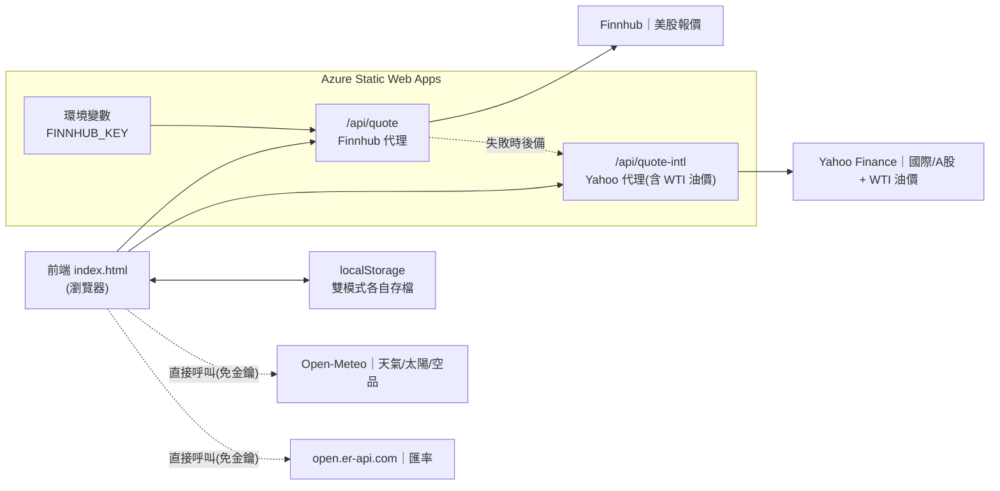

# Energy Empire ⚡

一款以「能源與能源類股」為主題的虛擬交易網頁遊戲。玩家以 **新台幣 NT$10,000,000** 起始資金,在可旋轉的 3D 地球上檢視各國能源結構、配置能源投資組合,並以**真實市場數據**買賣能源類股、追蹤資產淨值與報酬。提供 🎮 **遊戲展示**(回合制、能源被動收入)與 📈 **模擬股票投資**(真實股價、純投資)兩種模式,各自獨立存檔。

> 核心特色:**雙模式**(遊戲展示／模擬股票投資,各自獨立存檔);串接真實 API 數據並**安全保管金鑰**(後端代理 + 環境變數);全遊戲**統一以新台幣計價**;股價資料具備**優雅降級(fallback)**機制,主來源失效時自動切換備援;並設定 **HTTP 安全標頭**(securityheaders.com 評等 A)。

- 🔗 線上展示:<https://nice-sky-0d0bb0900.7.azurestaticapps.net/>
- 👤 作者/組員:【請填入姓名與分工】
- 🏫 課程 / 指導老師 / 學校:【請填入課程資訊】

---

## 功能特色

- **雙模式切換**:🎮 遊戲展示(回合制、能源被動收入、隨機事件、模擬股價)與 📈 模擬股票投資(真實股價、無回合),兩模式資料各自獨立、互不影響。
- **3D 互動地球**:以 HTML5 Canvas 繪製的可互動地球(球面投影 + 旋轉),可拖曳、自動旋轉,點擊國家可查看其能源結構。
- **能源市場(綠能策略)**:配置太陽能、石油、煤、核能、風能占比。**再生能源(太陽+風)占比越高,每回合被動收入越高**;面板即時顯示「再生占比、綠能加成、累計投入、回本回合」,讓玩家評估投資是否划算。(遊戲展示模式)
- **股票市場(真實數據)**:8 支能源相關個股,涵蓋**美國、丹麥、中國**三個市場。主來源(Finnhub)失敗時**自動改用 Yahoo 後備**,確保報價不中斷。
- **原幣 + 台幣雙欄顯示**:左欄為各股原始幣別價格(USD / DKK / CNY),右欄依即時匯率換算為新台幣。
- **統一台幣經濟**:現金、買賣、持倉、損益全部以新台幣計價;上方 HUD 常駐顯示**總資產淨值與報酬率**。
- **投資組合 CRUD**:買進、加碼(加權平均成本)、部分/全部賣出,並計算個別與總損益。
- **結算系統**:一鍵結算,顯示總資產淨值、總報酬率、最賺/最賠持股與評等。
- **即時數據儀表板**:整合**真實 WTI 油價**、天氣、太陽輻射、空氣品質等公開資料。
- **自動存檔**:每次操作後自動寫入瀏覽器 localStorage,兩模式分開保存,重開自動載入。
- **背景音樂**:雙曲目循環播放,可控制播放/停止與音量(iOS 因系統限制改用實體音量鍵)。

---

## 玩法說明

**目標**:讓**總資產淨值**盡量成長,隨時可按「📊 結算」查看總報酬率與評等。

**畫面配置**
- **上方 HUD**:現金、總資產淨值與報酬率(隨時掌握整體賺賠);遊戲展示模式另顯示回合數。
- **能源市場**(遊戲展示模式):能源結構占比,以及再生占比、綠能加成、累計投入、回本回合。
- **股票市場**:8 支個股的原幣價與台幣價。
- **我的持倉**:已買進的股票、成本與損益。
- **即時數據**:WTI 油價、天氣、太陽輻射、空氣品質等真實資料。

### 🎮 遊戲展示模式(回合制、模擬股價)

用於展示遊戲機制;此模式股價為**模擬隨機波動**(非真實)。

**兩種獲利方式**
1. **能源投資(被動收入)**:投資 ☀️太陽 / 🛢️石油 / ⚛️核能 / 💨風能 來調整能源結構(每次 NT$30 萬)。**再生能源(太陽+風)占比越高,每回合被動收入越高**;投資化石或核能會稀釋再生占比、使收入下降。可參考面板的「回本回合」判斷是否划算。
2. **股票交易(資本利得)**:用「📈 買股票」以台幣買進、在持倉用「📉 賣股票」賣出,買低賣高賺價差。

**一回合的流程**
1. 回合內自由進行能源投資與股票買賣。
2. 按「⏭️ 下一回合」:回合 +1、依再生占比發放被動收入、股價隨機波動,並有機率觸發影響能源結構的隨機事件。
3. 想看成績時按「📊 結算」:顯示總資產淨值、總報酬率、最賺/最賠持股與評等。

**策略提示**
- 早期把資金投入**太陽能與風能**拉高再生占比,讓被動收入這台「印鈔機」越來越強。
- 同時盯住 8 支真實個股,逢低買進、逢高賣出賺價差。
- 兩種收入引擎並進,淨值成長最快。

### 📈 模擬股票投資模式(真實股價、純投資)

以**真實市場股價**進行模擬投資,**無回合、無被動收入、無隨機事件**:

- 股價為真實報價,每 5 分鐘自動更新,亦可手動「刷新即時報價」。
- 起始資金 **NT$10,000,000**,以「買股票/賣股票」操作,HUD 即時顯示淨值與報酬率。
- 事件紀錄以**台北時間**標記(非回合)。

---

## 結算公式

> 「淨值、報酬率、損益、評等」公式**兩種模式共用**;起始資金固定為 **NT$10,000,000**。

**① 幣別換算(原幣 → 台幣)**
```
台幣價 = toTWD(原幣價, 幣別)        // 依 open.er-api 即時匯率(以 USD 為基準)換算
```

**② 加權平均持倉成本(買入時,avgCost 一律以台幣計)**
```
新持倉:      avgCost = 買入當下台幣價
加碼既有持倉: avgCost = (舊avgCost × 舊股數 + 買入台幣價 × 買入股數) / (舊股數 + 買入股數)
            股數 += 買入股數
```

**③ 單檔損益**
```
損益率 = (台幣現價 − avgCost) / avgCost × 100%
損益額 = (台幣現價 − avgCost) × 股數
```

**④ 賣出**
```
收回現金 = 台幣現價 × 賣出股數
本次損益 = (台幣現價 − avgCost) × 賣出股數
```

**⑤ 總資產淨值**
```
淨值 = 現金 + Σ( 每檔持倉台幣現價 × 股數 )
```
> 若某檔現價暫時無法取得,該檔以 avgCost 計入,避免淨值跳動。

**⑥ 總報酬率**
```
總報酬率 = (淨值 − 起始資金) / 起始資金 × 100%
         = (淨值 − 10,000,000) / 10,000,000 × 100%
```

**⑦ 結算評等(依總報酬率 ret)**

| 總報酬率 ret | 評等 |
|---|---|
| ret ≥ +30% | 🏆 能源大亨 |
| +10% ≤ ret < +30% | 🌟 精明投資人 |
| 0% ≤ ret < +10% | 🙂 穩健保本 |
| −15% ≤ ret < 0% | 😐 小幅虧損 |
| ret < −15% | 💸 再接再厲 |

**⑧ 遊戲展示模式專屬公式**
```
回合收入 = round( 120,000 + 再生能源占比 × 600,000 + 隨機(0 ~ 80,000) )
再生能源占比 = (太陽能% + 風能%) / 100

股價隨機波動(每回合、每檔):
新股價 = max( 1, 現股價 × (0.93 + 隨機(0 ~ 0.16)) )      // 約 −7% ~ +9%

能源投資:每次投入 NT$300,000 → 該類型產能 +8(上限 60) → 正規化使占比總和 = 100%
綠能加成(每回合) = round( 再生能源占比 × 600,000 )
回本回合 = ⌈ 累計投入能源 ÷ 綠能加成 ⌉                    // 加成 > 0 時
隨機事件:每回合 40% 機率觸發,隨機改變某能源類型占比
```

---

## 系統架構



**設計原則**:只有需要保護金鑰的來源(Finnhub)走後端代理;其餘免金鑰且支援 CORS 的公開資料,直接由前端取得,以降低複雜度。Yahoo Finance 雖免金鑰,但為統一介面、避免 CORS、並作為美股後備與 WTI 油價來源,亦以後端代理提供。

---

## 技術架構

| 層級 | 使用技術 |
|------|----------|
| 前端 | 原生 HTML / JavaScript、Tailwind CSS (CDN)、Lucide Icons、HTML5 Canvas |
| 後端 | Azure Functions(Node.js v4 程式模型,serverless API) |
| 資料保存 | 瀏覽器 localStorage(雙模式各自獨立存檔) |
| 安全 | `staticwebapp.config.json` 設定 HTTP 安全標頭(CSP/HSTS…) |
| 部署 | Azure Static Web Apps,透過 GitHub Actions 自動 CI/CD |
| 版本控管 | GitHub:watertea-lab/energy-empire |

---

## 股票清單

| 代號 | 公司 | 市場 | 幣別 | 主要來源 |
|------|------|------|------|----------|
| XOM | ExxonMobil | 美國 | USD | Finnhub（後備 Yahoo） |
| NEE | NextEra Energy | 美國 | USD | Finnhub（後備 Yahoo） |
| CCJ | Cameco | 美國 | USD | Finnhub（後備 Yahoo） |
| ORSTED | Ørsted | 丹麥(哥本哈根) | DKK | Yahoo Finance |
| 601857 | 中國石油 | 中國(上海) | CNY | Yahoo Finance |
| 600688 | 上海石化 | 中國(上海) | CNY | Yahoo Finance |
| 600905 | 三峽能源 | 中國(上海) | CNY | Yahoo Finance |
| 300750 | 寧德時代(CATL) | 中國(深圳) | CNY | Yahoo Finance |

---

## 真實數據來源

| 資料 | 來源 | 取得方式 |
|------|------|----------|
| 美股報價 | Finnhub（主)＋ Yahoo（後備) | 後端代理 `/api/quote`;失敗時自動改用 `/api/quote-intl` |
| 國際 / A 股報價 | Yahoo Finance v8 chart | 後端代理 `/api/quote-intl` |
| WTI 原油油價 | Yahoo Finance(`CL=F`) | 後端代理 `/api/quote-intl?symbol=CL=F`;取不到時誠實提示、不湊假數字 |
| 匯率(USD / DKK / CNY → TWD) | open.er-api.com | 前端直接呼叫(免金鑰、支援 CORS) |
| 天氣 / 太陽輻射 / 風速 / 空氣品質 | Open-Meteo | 前端直接呼叫 |

---

## 專案結構

```
energy-empire/
├── index.html                       # 前端單頁應用(遊戲本體)
├── README.md
├── staticwebapp.config.json         # HTTP 安全標頭(CSP / HSTS …)設定
├── bgm.mp3 / bgm2.mp3               # 背景音樂(雙曲目)
├── api/                             # Azure Functions 後端
│   ├── host.json                    # Functions 主機設定
│   ├── package.json                 # 相依套件(@azure/functions)
│   └── src/functions/
│       ├── quote.js                 # Finnhub 代理(美股),金鑰由環境變數讀取
│       └── quote-intl.js            # Yahoo Finance 代理(國際 / A 股 + WTI 油價,兼作美股後備)
└── .github/workflows/
    └── azure-static-web-apps-*.yml  # GitHub Actions 自動部署設定
```

---

## 後端 API 端點

| 端點 | 方法 | 參數 | 說明 |
|------|------|------|------|
| `/api/quote` | GET | `symbol`(如 `XOM`) | 代理 Finnhub 報價,回傳 `{ c, pc, h, l, o, ... }` |
| `/api/quote-intl` | GET | `symbol`(如 `601857.SS`、`ORSTED.CO`、`300750.SZ`、`CL=F`、`XOM`) | 代理 Yahoo Finance,回傳與 Finnhub 一致的 `{ c, pc }`;亦作為美股後備與 WTI 油價來源 |

兩支函式回傳相同形狀的 JSON,前端因此可用同一套邏輯解析。

---

## 安全性設計

### 金鑰保護

本專案刻意避免將 API 金鑰寫入前端:

1. **後端代理**:前端只呼叫同源的 `/api/quote`,不直接呼叫 Finnhub;金鑰永遠不進入瀏覽器。
2. **環境變數保管**:Finnhub 金鑰存於 Azure Static Web Apps 的環境變數 `FINNHUB_KEY`,後端函式以 `process.env.FINNHUB_KEY` 讀取;**金鑰不存在於任何原始碼或版本紀錄中**。部署金鑰則存於 **GitHub Secrets**。
3. **金鑰輪替**:已執行金鑰 regenerate(輪替),確保任何先前可能暴露的金鑰皆已失效。

### HTTP 安全標頭

`staticwebapp.config.json` 設定下列回應標頭:**Content-Security-Policy**(預設拒絕 + 白名單)、**Strict-Transport-Security**(HSTS)、**X-Frame-Options**、**X-Content-Type-Options**、**Referrer-Policy**、**Permissions-Policy**。securityheaders.com 實測評等 **A**。

### 其他

- **無登入、無蒐集個資**:所有遊戲資料僅存於使用者本機 localStorage,不上傳、不跨裝置同步。

> 已知限制:代理端點本身為公開資源,雖然金鑰不外洩,但端點仍可被匿名呼叫(可能消耗免費方案額度)。考量本專案為非營利教學展示,此風險可接受;進一步可加上代號白名單或速率限制。公開前端無法對自身請求做真正驗證,屬此類架構的固有限制。

> 關於 CORS:跨來源請求可在本機以瀏覽器外掛繞過(開發便利),但僅對本機有效;正式、對所有使用者皆有效的解法是**後端代理**——這也是本專案股價走 Azure Functions 的原因(同時順帶保護金鑰)。

---

## 部署方式(Azure Static Web Apps + GitHub)

1. 將專案推送至 GitHub repo(已連結 Azure Static Web Apps)。
2. 在 GitHub Actions 的 workflow 中指定建置位置:
   ```yaml
   app_location: "/"
   api_location: "api"
   output_location: ""
   ```
3. 於 Azure 入口網站 → 該 Static Web App → **設定 / 環境變數**,新增:
   ```
   FINNHUB_KEY = <你的 Finnhub API 金鑰>
   ```
4. 推送至 `main` 分支即自動透過 GitHub Actions 建置與部署。

---

## 開發歷程(解決的問題)

| 問題 | 解法 |
|------|------|
| API 金鑰原本寫死在前端,任何人皆可由原始碼取得 | 改為後端 serverless 代理,金鑰移至環境變數 |
| 瀏覽器直接呼叫 Finnhub 遭遇 CORS / 金鑰外洩 | 由後端函式代為呼叫 |
| Azure 部署時 Oryx 要求 build 腳本而失敗 | 於 `package.json` 加入 no-op build 腳本 |
| Finnhub 免費方案不涵蓋國際 / A 股 | 新增 Yahoo Finance 代理函式,回傳一致的資料形狀 |
| 各市場幣別不同,使用者難以比較 | 加上即時匯率台幣換算欄 |
| 資產與損益因幣別不一而難以一致衡量 | 將整個遊戲經濟**統一為新台幣計價**,並提供總資產淨值與結算 |
| Finnhub 免費金鑰偶發失效 / 限制,影響美股報價 | 加入**後備機制**:主來源失敗時自動改用 Yahoo 抓取同一支美股 |
| 能源投資原本對結果影響甚微、近乎裝飾 | **重新平衡**:再生能源占比明顯提高被動收入,並顯示加成 / 累計投入 / 回本回合 |
| World Bank 來源在瀏覽器端 CORS 受限且無台灣資料 | **移除**碳排 / 用電兩項,保留穩定可用的即時資料源 |
| 單一玩法不夠彈性 | **新增雙模式**:🎮 遊戲展示與 📈 模擬股票投資,各自獨立 localStorage 存檔 |
| 重新整理會遺失進度 | **實作 localStorage 自動存檔**(雙模式分開保存,重開自動載入) |
| 油價原為推估值、來源標示不實 | 改抓**真實 WTI(`CL=F`)**經 Yahoo 代理;取不到時誠實提示、不湊假數字 |
| 安全標頭不足(securityheaders 評等 C) | 新增 `staticwebapp.config.json`(CSP / HSTS …),評等提升至 **A** |
| 音量滑桿在 iPhone 無效 | 偵測 iOS(WebKit 不允許 JS 調音量)時隱藏滑桿、改用實體音量鍵 |

---

## 已知限制與未來方向

- **盤後為收盤價**:非交易時段取得的為最近收盤價,屬正常現象。
- **匯率更新頻率**:免費匯率來源約每日更新,台幣換算為近似值。
- **資料保存**:已用 localStorage 雙模式存檔;惟為**本機儲存**,清除瀏覽資料即遺失,部分瀏覽器(如 Safari ITP)有保存天數限制。
- **iOS 音量**:iOS / WebKit 不允許網頁以 JS 調整音量,故偵測到 iOS 時隱藏音量滑桿、改用實體音量鍵。
- **Tailwind Play CDN**:目前用於開發便利;正式環境可改以 Tailwind CLI 編譯靜態 CSS,以提升效能(Lighthouse 分數)。
- **已移除 World Bank 來源**:其 API 在瀏覽器端受 CORS 限制、且資料庫不含台灣資料;若日後要補回碳排 / 用電,建議改走後端代理(如同股價的做法)。
- **可擴充**:可再新增更多市場資料源(如台灣發電量開放資料),沿用相同的後端代理模式。

---

## 設計文件(Draw.io)

- 系統架構圖、資料流程圖(DFD)、循序圖(報價 + Yahoo 後備)、使用案例圖(Use Case)、程式流程圖(買股票)。

---

## 授權

【請填入,例如:本專案僅供課程作業與學習用途。】
