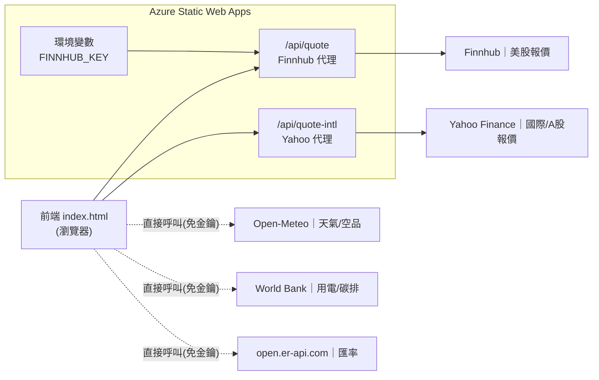

# Energy Empire ⚡

一款以「能源與能源類股」為主題的虛擬交易網頁遊戲。玩家在可旋轉的 3D 地球上檢視各國能源結構,操作能源投資組合,並以**真實市場數據**買賣能源類股、追蹤損益。

> 本專案的核心特色之一是「**串接真實 API 數據,並安全保管 API 金鑰**」:需要金鑰的資料來源透過後端 serverless 代理取得,API 金鑰存放於雲端環境變數,完全不暴露於前端原始碼或版本紀錄中。

- 🔗 線上展示:【https://nice-sky-0d0bb0900.7.azurestaticapps.net/ 】
- 👤 作者/組員:【請填入姓名與分工】
- 🏫 課程 / 指導老師 / 學校:【請填入課程資訊】

---

## 功能特色

- **3D 互動地球**:以 HTML5 Canvas 手刻投影繪製,可拖曳旋轉、自動旋轉,點擊國家可查看其能源結構。
- **能源市場**:太陽能、石油、煤、核能、風能的占比配置與投資操作。
- **股票市場(真實數據)**:8 支能源相關個股,涵蓋**美國、丹麥、中國**三個市場的即時/近即時報價。
- **原幣 + 台幣雙欄顯示**:左欄為各股原始幣別價格(USD / DKK / CNY),右欄依即時匯率換算為新台幣。
- **投資組合 CRUD**:買進(Create)、持倉檢視(Read)、加碼以加權平均成本更新(Update)、部分/全部賣出(Delete),並計算個別與總損益。
- **事件系統與即時數據儀表板**:結合天氣、空氣品質、用電與碳排等公開資料。

---

## 系統架構



**設計原則**:只有需要保護金鑰的來源(Finnhub)走後端代理;其餘免金鑰且支援 CORS 的公開資料,直接由前端取得,以降低複雜度。Yahoo Finance 雖免金鑰,但為統一介面與避免 CORS 問題,亦以後端代理提供。

---

## 技術架構

| 層級 | 使用技術 |
|------|----------|
| 前端 | 原生 HTML / JavaScript、Tailwind CSS (CDN)、Lucide Icons、HTML5 Canvas |
| 後端 | Azure Functions(Node.js v4 程式模型,serverless API) |
| 部署 | Azure Static Web Apps,透過 GitHub Actions 自動 CI/CD |
| 版本控管 | GitHub:watertea-lab/energy-empire |

---

## 股票清單

| 代號 | 公司 | 市場 | 幣別 | 資料來源 |
|------|------|------|------|----------|
| XOM | ExxonMobil | 美國 | USD | Finnhub |
| NEE | NextEra Energy | 美國 | USD | Finnhub |
| CCJ | Cameco | 美國 | USD | Finnhub |
| ORSTED | Ørsted | 丹麥(哥本哈根) | DKK | Yahoo Finance |
| 601857 | 中國石油 | 中國(上海) | CNY | Yahoo Finance |
| 600688 | 上海石化 | 中國(上海) | CNY | Yahoo Finance |
| 600905 | 三峽能源 | 中國(上海) | CNY | Yahoo Finance |
| 300750 | 寧德時代(CATL) | 中國(深圳) | CNY | Yahoo Finance |

---

## 真實數據來源

| 資料 | 來源 | 取得方式 |
|------|------|----------|
| 美股報價 | Finnhub | 後端代理 `/api/quote`(金鑰保護) |
| 國際 / A 股報價 | Yahoo Finance v8 chart | 後端代理 `/api/quote-intl` |
| 匯率(USD / DKK / CNY → TWD) | open.er-api.com | 前端直接呼叫(免金鑰、支援 CORS) |
| 天氣 / 太陽輻射 / 風速 / 空氣品質 | Open-Meteo | 前端直接呼叫 |
| 用電量 / 碳排放 | World Bank Open Data | 前端直接呼叫 |

---

## 專案結構

```
energy-empire/
├── index.html                       # 前端單頁應用(遊戲本體)
├── README.md
├── api/                             # Azure Functions 後端
│   ├── host.json                    # Functions 主機設定
│   ├── package.json                 # 相依套件(@azure/functions)
│   └── src/functions/
│       ├── quote.js                 # Finnhub 代理(美股),金鑰由環境變數讀取
│       └── quote-intl.js            # Yahoo Finance 代理(國際 / A 股)
└── .github/workflows/
    └── azure-static-web-apps-*.yml  # GitHub Actions 自動部署設定
```

---

## 後端 API 端點

| 端點 | 方法 | 參數 | 說明 |
|------|------|------|------|
| `/api/quote` | GET | `symbol`(如 `XOM`) | 代理 Finnhub 報價,回傳 `{ c, pc, h, l, o, ... }` |
| `/api/quote-intl` | GET | `symbol`(如 `601857.SS`、`ORSTED.CO`、`300750.SZ`) | 代理 Yahoo Finance,回傳與 Finnhub 一致的 `{ c, pc }` |

兩支函式回傳相同形狀的 JSON,前端因此可用同一套邏輯解析。

---

## 安全性設計(金鑰保護)

本專案刻意避免將 API 金鑰寫入前端:

1. **後端代理**:前端只呼叫同源的 `/api/quote`,不直接呼叫 Finnhub;金鑰永遠不進入瀏覽器。
2. **環境變數保管**:Finnhub 金鑰存於 Azure Static Web Apps 的環境變數 `FINNHUB_KEY`,後端函式以 `process.env.FINNHUB_KEY` 讀取;**金鑰不存在於任何原始碼或版本紀錄中**。
3. **金鑰輪替**:已執行金鑰 regenerate(輪替),確保任何先前可能暴露的金鑰皆已失效。

> 已知限制:代理端點本身為公開資源,雖然金鑰不外洩,但端點仍可被匿名呼叫(可能消耗免費方案額度)。考量本專案為非營利教學展示,此風險可接受;進一步可加上代號白名單或速率限制。公開前端無法對自身請求做真正驗證,屬此類架構的固有限制。

---

## 部署方式(Azure Static Web Apps + GitHub)

1. 將專案推送至 GitHub repo(已連結 Azure Static Web Apps)。
2. 在 GitHub Actions 的 workflow 中指定建置位置:
   ```yaml
   app_location: "/"
   api_location: "api"
   output_location: ""
   ```
3. 於 Azure 入口網站 → 該 Static Web App → **設定 / 環境變數**,新增:
   ```
   FINNHUB_KEY = <你的 Finnhub API 金鑰>
   ```
4. 推送至 `main` 分支即自動透過 GitHub Actions 建置與部署。

---

## 開發歷程(解決的問題)

| 問題 | 解法 |
|------|------|
| API 金鑰原本寫死在前端,任何人皆可由原始碼取得 | 改為後端 serverless 代理,金鑰移至環境變數 |
| 瀏覽器直接呼叫 Finnhub 遭遇 CORS / 金鑰外洩 | 由後端函式代為呼叫 |
| Azure 部署時 Oryx 要求 build 腳本而失敗 | 於 `package.json` 加入 no-op build 腳本 |
| Finnhub 免費方案不涵蓋國際 / A 股 | 新增 Yahoo Finance 代理函式,回傳一致的資料形狀 |
| 各市場幣別不同,使用者難以比較 | 串接即時匯率,加上台幣換算欄 |

---

## 已知限制與未來方向

- **幣別與遊戲資金單位**:股價顯示為各自真實幣別,但遊戲內「資金 / 交易結算」使用統一的遊戲單位;未來可全面以單一幣別結算以求財務一致。
- **盤後為收盤價**:非交易時段取得的為最近收盤價,屬正常現象。
- **匯率更新頻率**:免費匯率來源約每日更新,台幣換算為近似值。
- **資料持久化**:目前遊戲狀態存於記憶體,重新整理會重置;可改用 `localStorage` 保存投資組合與資金。
- **可擴充**:可再新增更多市場資料源(如台灣發電量開放資料),沿用相同的後端代理模式。

---

## 授權

【本專案僅供課程作業與學習用途。】
